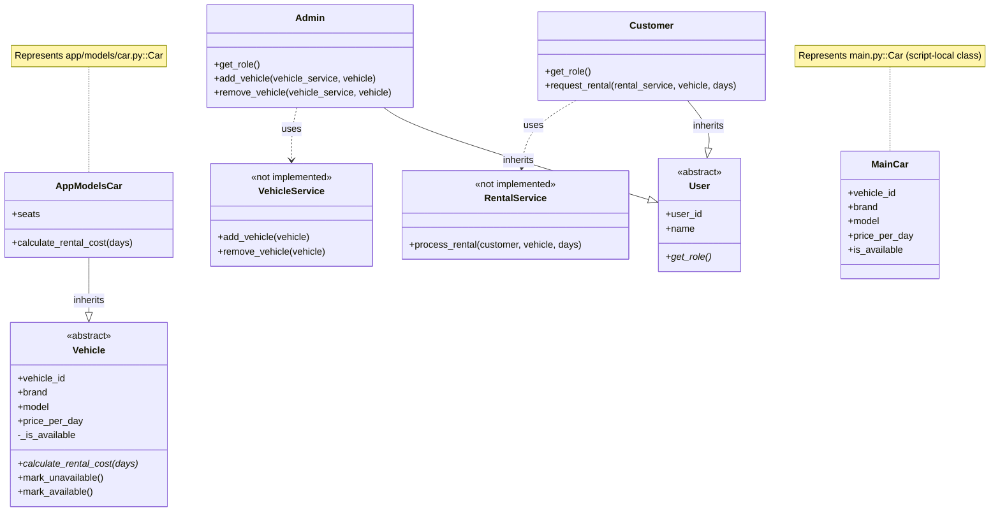

# UML Class Diagram

## Notes

- `app/models/rental.py` is currently empty.
- `app/services/rental_service.py` is currently empty.
- `RentalService` and `VehicleService` in the diagram are inferred from method calls in user models and are not implemented as classes yet.
