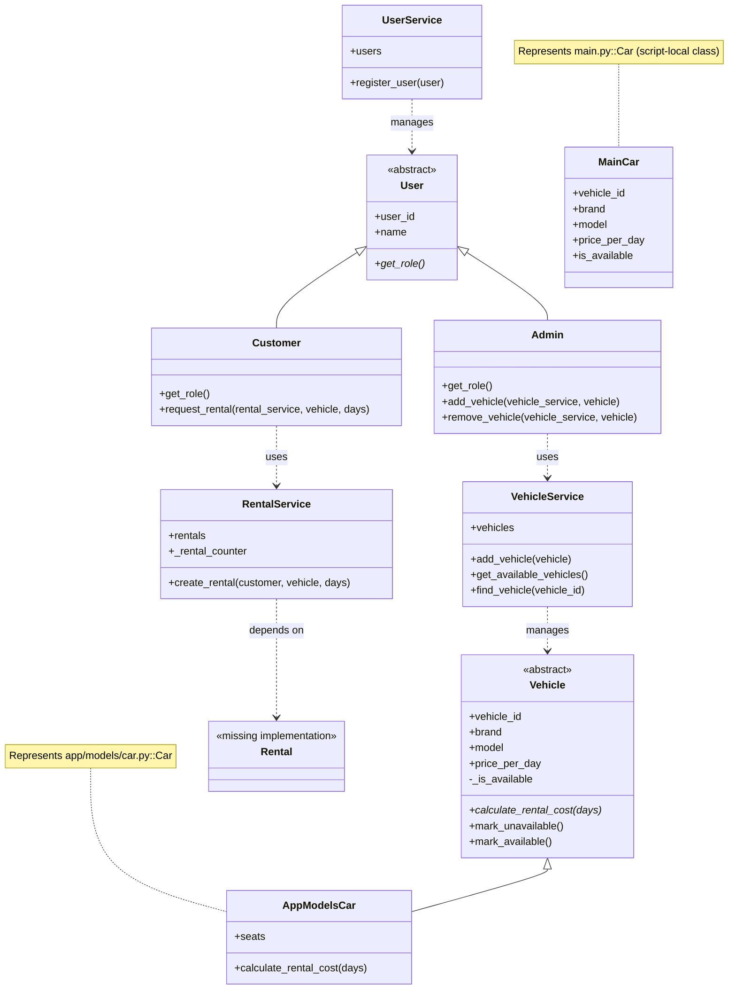

# UML Class Diagram

## Notes

- `app/models/customer.py` and `app/models/admin.py` inherit from `User`.
- `app/services/user_service.py.py` defines `UserService`.
- `app/services/vehicle_service.py` defines `VehicleService`.
- `app/services/rental_service.py` defines `RentalService` and imports `Rental` from an empty `app/models/rental.py`.
- `app/models/customer.py` still calls `rental_service.process_rental(...)`, while `RentalService` currently exposes `create_rental(...)`.
