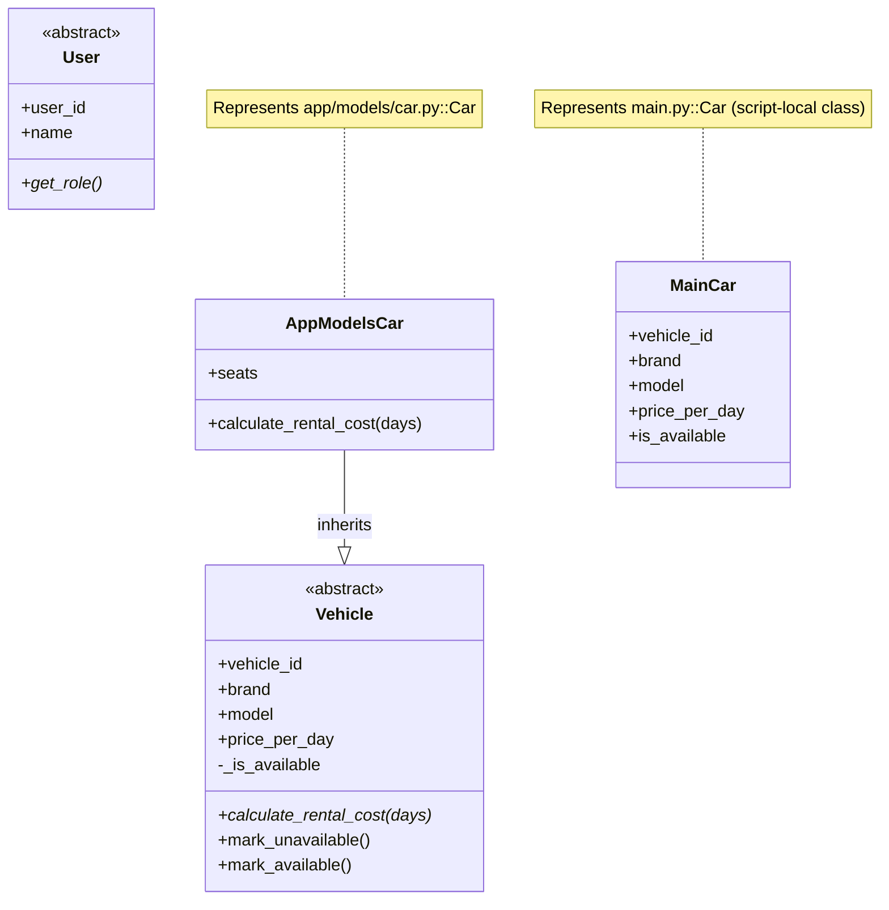

# UML Class Diagram

## Notes

- `app/models/admin.py` is currently empty.
- `app/models/customer.py` is currently empty.
- `app/models/rental.py` is currently empty.
- No associations/compositions are currently implemented between user/rental/vehicle entities.
